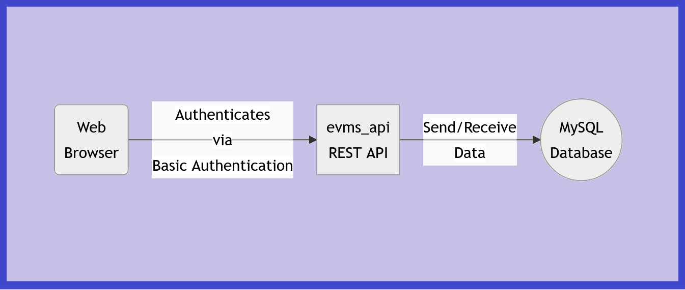
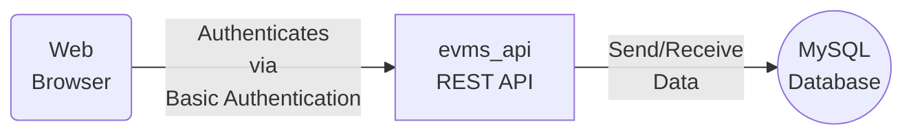

# Java SQL Tutorial:  Secure SpringBoot REST API (Part2/Final)

## Workflow

```mermaid
graph LR
A(Web<br/>Browser) -- Authenticates<br/>via<br/>Basic Authentication -->  B[evms_api<br/>REST API] -- Send/Receive<br/>Data --> C((MySQL <br/>Database))
```

## Tutorial
